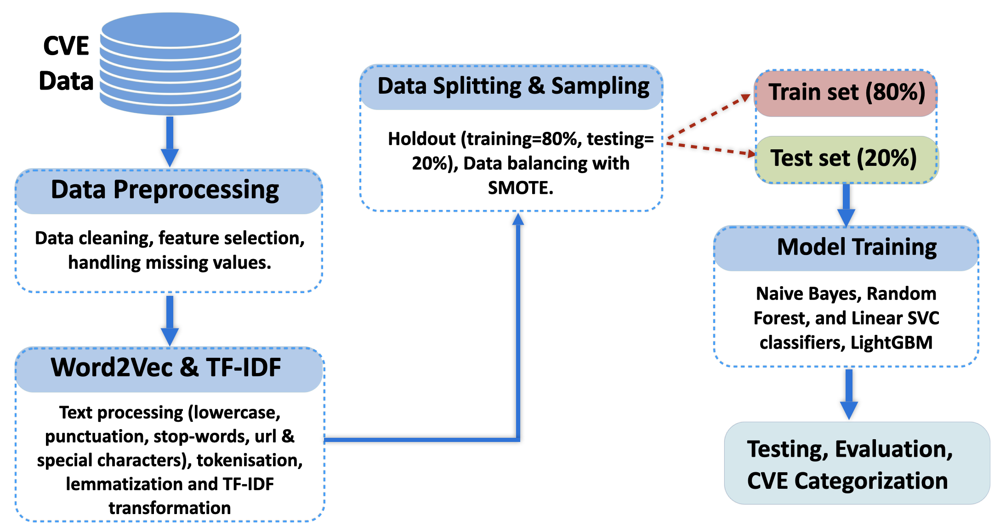

# Machine Learning-based: Enhanced Categorization of Cybersecurity Vulnerabilities

[](LICENSE)  
[](https://ieeexplore.ieee.org/abstract/document/10754709)  
[](https://scholar.google.com/citations?view_op=view_citation&hl=en&user=fk1n8VQAAAAJ&citation_for_view=fk1n8VQAAAAJ:qjMakFHDy7sC)

This repository contains the implementation, dataset preprocessing pipeline, and experimental results for our research on **machine learning-based categorization of cybersecurity vulnerabilities**, published at **IEEE UEMCON 2024**.

🏆 The work was awarded **Best Research Poster** at Tennessee Tech’s Annual Research Conference.

---
## CVE Categorization System Architecture



*Figure 2: End-to-end architecture of the CVE categorization system, including dataset preprocessing, feature engineering, class imbalance handling (SMOTE), supervised model training, and evaluation pipeline.*
## Overview

Software vulnerabilities (CVEs) pose critical security risks across modern software systems. Manual vulnerability classification is time-consuming, inconsistent, and prone to human error.

This project proposes a **supervised machine learning framework** for automated classification of cybersecurity vulnerabilities using structured metadata and textual CVE descriptions.

The approach includes:

- Data preprocessing and label normalization  
- Handling multi-label CVEs via record expansion  
- Text cleaning and feature engineering  
- Class imbalance mitigation using SMOTE  
- Comparative evaluation across multiple ML models  

The framework demonstrates strong predictive performance in categorizing CVEs into 13 standardized vulnerability classes.

---

## Dataset

The dataset was derived from the public repository of Yosifova et al. (2021) and originally scraped from the **CVE Security Vulnerability Database (CVE Details)**.

- 📅 Time span: 1999–2019  
- 📊 Original records: 123,000 CVEs  
- 📈 Final processed records: 162,789  
- 🏷 13 standardized vulnerability categories  

Each CVE contains attributes such as:

- CVE-ID  
- CVSS score  
- Access mode  
- Attack complexity  
- Textual vulnerability description  
- Vulnerability type  

Multi-label CVEs were separated into individual records to ensure clean supervised learning.

---

## Research Paper & Award

- 📄 **Paper (IEEE UEMCON 2024):**  
  https://ieeexplore.ieee.org/abstract/document/10754709  

- 🖼 **Best Research Poster Award:**  
  Tennessee Tech University Annual Research Conference  

---

## Installation

```bash
# Clone repository
git clone https://github.com/EkleTony/CyberVuln-ML.git
cd CyberVuln-ML

# Install dependencies
pip install -r requirements.txt

### Requirements
The following dependencies are required to run the project:
- Python 3.x
- Jupyter Notebook
- NumPy
- Pandas
- Scikit-learn
- TensorFlow
- Torch
- Matplotlib
- Seaborn
- NLTK
- TQDM
- WordNetLemmatizer (NLTK)
- IMBlearn (SMOTE)
- OS
- RE (Regular Expressions)
- String

Ensure the dataset is placed in the correct directory before running the notebooks.

## Usage
Run the Jupyter Notebook using:
```bash
jupyter notebook JupyterNote_CVE_Prediction_Code.ipynb
```

## License
This project is licensed under the **MIT License**. You are free to use, modify, and distribute the dataset and code with proper attribution. However, if using this dataset in academic or research work, please **cite the following paper**:

```
@inproceedings{ekle2024enhanced,
  title={Enhanced Categorization of Cybersecurity Vulnerabilities},
  author={Ekle, Ocheme Anthony and Ulybyshev, Denis},
  booktitle={2024 IEEE 15th Annual Ubiquitous Computing, Electronics \& Mobile Communication Conference (UEMCON)},
  pages={800--806},
  year={2024},
  organization={IEEE}
}
```

